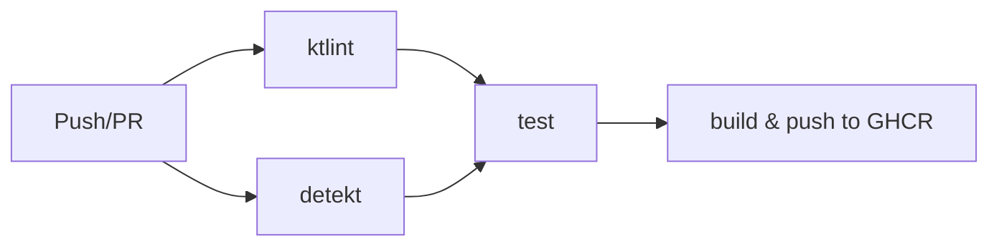

# GitHub Actions セットアップガイド

このドキュメントでは、GitHub Actions を使用して自動ビルドと GitHub Container Registry (GHCR) へのプッシュを設定する方法を説明します。

## ワークフローの概要



- **ktlint** と **detekt** は並行実行
- **test** は ktlint と detekt の両方が成功後に実行
- **build & push** は test が成功後に実行（main ブランチまたはタグのみ）

## GitHub Container Registry (GHCR) セットアップ

### 1. パッケージの可視性設定

1. GitHub でリポジトリのページを開く
2. Settings → Actions → General
3. Workflow permissions で以下を確認：
   - `Read and write permissions` が選択されている
   - `Allow GitHub Actions to create and approve pull requests` はオプション

### 2. Personal Access Token (オプション - ローカルテスト用)

ローカルから GHCR にアクセスする場合のみ必要：

1. GitHub → Settings → Developer settings → Personal access tokens → Tokens (classic)
2. `New personal access token` をクリック
3. 以下のスコープを選択：
   - `write:packages` - パッケージのアップロード
   - `read:packages` - パッケージのダウンロード
   - `delete:packages` - パッケージの削除（オプション）

## ワークフローの動作

### トリガー条件

- **main/develop ブランチへのプッシュ**: フルビルド + GHCR へプッシュ
- **タグ作成** (v* パターン): フルビルド + GHCR へプッシュ（セマンティックバージョニング）
- **プルリクエスト**: ビルドのみ（プッシュなし）

### イメージタグ戦略

タグプッシュ時（例: `v1.2.3`）:
- `ghcr.io/[owner]/redisson-redis-cluster:1.2.3` - 完全バージョン
- `ghcr.io/[owner]/redisson-redis-cluster:1.2` - マイナーバージョン
- `ghcr.io/[owner]/redisson-redis-cluster:1` - メジャーバージョン
- `ghcr.io/[owner]/redisson-redis-cluster:latest` - 最新（main ブランチ時）

ブランチプッシュ時:
- `ghcr.io/[owner]/redisson-redis-cluster:main-abc1234` - ブランチ名-コミットSHA
- `ghcr.io/[owner]/redisson-redis-cluster:latest` - main ブランチの場合

## 使用方法

### 開発フロー

```bash
# 機能ブランチで開発
git checkout -b feature/new-feature

# コミット
git add .
git commit -m "Add new feature"

# プッシュ（PR作成）
git push origin feature/new-feature
# → ktlint, detekt, test, build が実行される（プッシュなし）

# main にマージ後
# → 自動的に GHCR へプッシュ
```

### リリースフロー

```bash
# タグを作成（セマンティックバージョニング推奨）
git tag v1.0.0
git push origin v1.0.0
# → 自動的に複数のタグで GHCR へプッシュ
```

## ローカルでの GHCR 利用

### ログイン

```bash
# GitHub Token を使用してログイン
echo $GITHUB_TOKEN | docker login ghcr.io -u YOUR_GITHUB_USERNAME --password-stdin

# または、GitHub CLI を使用
gh auth token | docker login ghcr.io -u YOUR_GITHUB_USERNAME --password-stdin
```

### イメージの取得

```bash
# パブリックイメージの場合（ログイン不要）
docker pull ghcr.io/[owner]/redisson-redis-cluster:latest

# プライベートイメージの場合（要ログイン）
docker login ghcr.io -u YOUR_GITHUB_USERNAME
docker pull ghcr.io/[owner]/redisson-redis-cluster:latest
```

### Kubernetes での利用

プライベートイメージの場合、imagePullSecret が必要：

```bash
# Secret を作成
kubectl create secret docker-registry ghcr-secret \
  --docker-server=ghcr.io \
  --docker-username=YOUR_GITHUB_USERNAME \
  --docker-password=YOUR_GITHUB_TOKEN \
  --docker-email=YOUR_EMAIL

# デプロイメントで使用
kubectl patch deployment redisson-redis-cluster -p '{"spec":{"template":{"spec":{"imagePullSecrets":[{"name":"ghcr-secret"}]}}}}'
```

## パッケージの管理

### パッケージの可視性変更

1. GitHub リポジトリページ → Packages
2. 対象パッケージをクリック
3. Package settings → Change visibility
4. Public または Private を選択

### パッケージの削除

```bash
# GitHub CLI を使用
gh api -X DELETE /user/packages/container/redisson-redis-cluster/versions/VERSION_ID

# または GitHub UI から:
# Packages → パッケージ選択 → Settings → Delete this version
```

## トラブルシューティング

### ktlint エラー

```bash
# ローカルで修正
./gradlew ktlintFormat
```

### detekt エラー

```bash
# ローカルで確認
./gradlew detekt

# ベースライン生成（既存の警告を無視）
./gradlew detektBaseline
```

### GHCR 認証エラー

1. Workflow permissions が正しく設定されているか確認
2. `GITHUB_TOKEN` が自動的に利用可能（Actions 内）
3. ローカルの場合は Personal Access Token が必要

### ビルドキャッシュ

GitHub Actions のキャッシュを使用してビルド時間を短縮：
- Gradle 依存関係のキャッシュ
- Docker レイヤーのキャッシュ（type=gha）

### Permission denied エラー

リポジトリ Settings → Actions → General で:
- Workflow permissions を `Read and write permissions` に設定
- Save をクリック

## セキュリティのベストプラクティス

1. **最小権限の原則**: 必要最小限の権限のみを付与
2. **トークン管理**: Personal Access Token は安全に管理
3. **イメージスキャン**: Trivy や Snyk でセキュリティスキャンを追加
4. **署名**: cosign でイメージに署名（オプション）

## 参考リンク

- [GitHub Container Registry ドキュメント](https://docs.github.com/en/packages/working-with-a-github-packages-registry/working-with-the-container-registry)
- [Docker Build Push Action](https://github.com/docker/build-push-action)
- [Docker Metadata Action](https://github.com/docker/metadata-action)